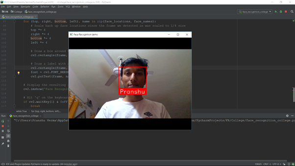
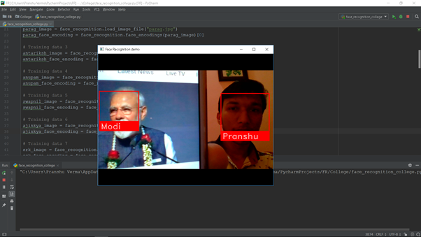

# Face-Recognition-using-Python
In this repository, we will create a simple Face Recognition using Python inbuilt libraries.

## How to use
1. Add the training data and the python file in the same folder. 
2. Open the file named "face_recognition.py"
3. Change the image_file name "pranshu.jpg" to your training data.
```
# Training data 1
pranshu_image = face_recognition.load_image_file("pranshu.jpg")
pranshu_face_encoding = face_recognition.face_encodings(pranshu_image)[0]
```
4. Add as many images as you want.

##### Note: You only need 1 image per person so you do not need to collect huge datasets :)
## Outputs




#### Thank You,
#### Pranshu Verma
